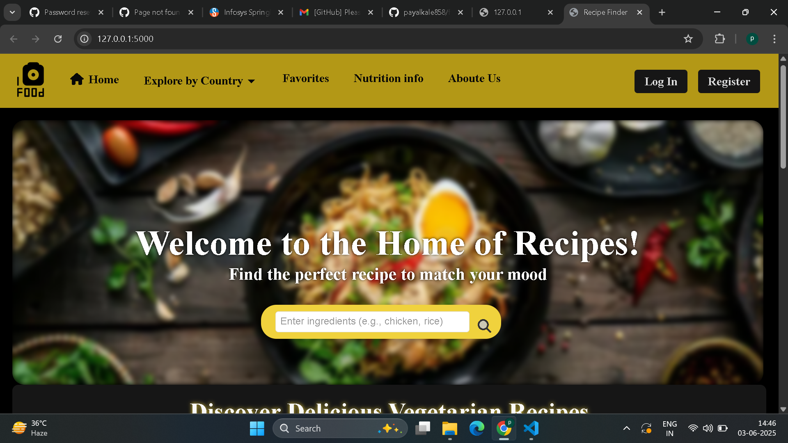
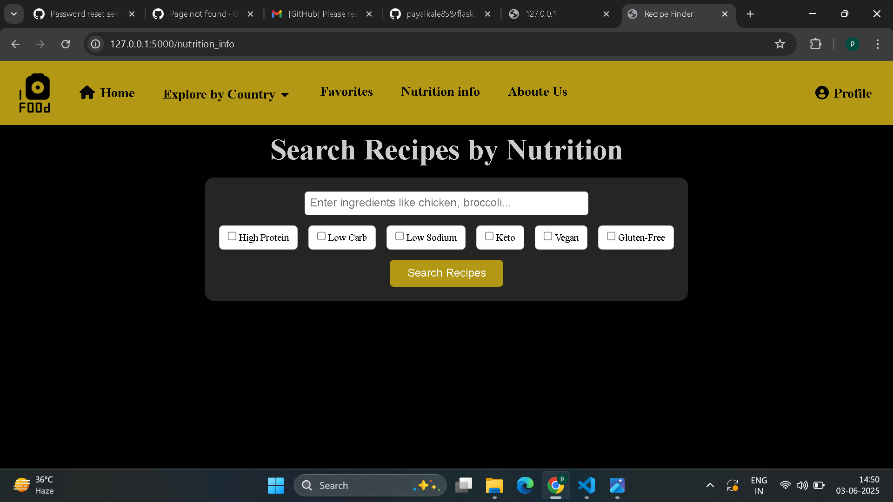

# 🍲 Recipe Finder App

A web application that helps users discover Indian recipes based on nutritional filters like high protein, low carb, etc.

## 🌟 Features

- 🔍 Search recipes by keyword
- 🥦 Filter by nutrition: High Protein, Low Carb, Low Fat
- 📄 View detailed recipe instructions
- 🖼️ See ingredients and images of recipes
- 💡 Clean and responsive UI

## 🛠️ Tech Stack

- **Frontend**: HTML, CSS, JavaScript
- **Backend**: Python, Flask
- **API/Data**: Custom dataset or Edamam API (you can mention your source)
- **Database**: SQLite or any other (if used)

## 🚀 Getting Started

### Prerequisites
- Python 3.12
- Flask (`pip install flask`)

### Run Locally

```bash
git clone https://github.com/payalkale858/recipe-finder-app.git
cd recipe-finder-app
python app.py

## 📸 Screenshots

### 🏠 Home Page


### 🍽️ Recipe Results by Nutrition


### 🌍 Recipes by Country


## 📬 Contact

Payal kale  
💼 [LinkedIn](httpswww.linkedin.cominyour-linkedin-url)  
📧 Email kalepayal53@gmail.com  
📍 Location maharashtra, India  

